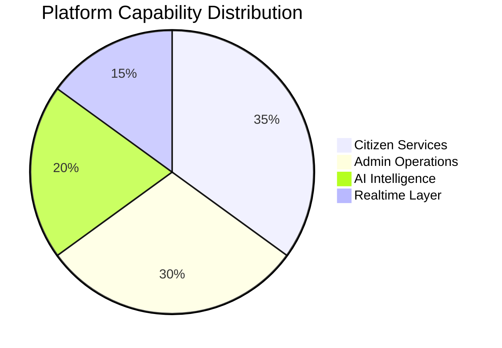
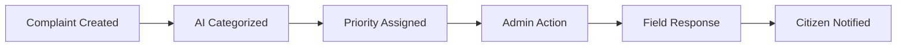
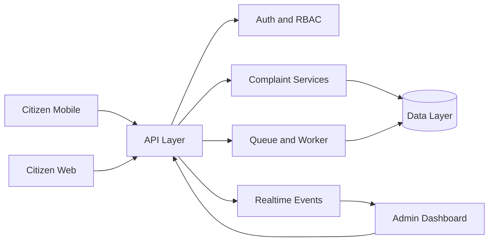

# Project-Sankalp
<div align="center">


<p>
  
  
  
</p>

</div>

---

## Executive Snapshot

Project-Sankalp is a full-stack civic platform that modernizes complaint handling, safety escalation, and governance visibility through AI-assisted workflows and realtime updates.

### Why it stands out

- Unified monorepo across backend, web, and mobile experiences
- AI-enabled categorization and prioritization touchpoints
- Realtime event pipeline for rapid operational awareness
- Administrator and citizen modules designed for city-scale use

---

## Quick Navigation

- [Key Metrics](#key-metrics)
- [Impact Graphs](#impact-graphs)
- [Architecture](#architecture)
- [Platform Modules](#platform-modules)
- [Technology Stack](#technology-stack)
- [Quick Start](#quick-start)
- [FAQ](#faq)
- [Team Seekers](#team-seekers)

---

## Key Metrics

| Metric | Value |
|---|---|
| Citizen workflows | 12+ |
| Admin modules | 8+ |
| AI capabilities | 6+ |
| Backend routes | 20+ |
| Realtime events | 5+ |
| Platforms | Web, Mobile, API |

---

## Impact Graphs

### Capability Mix



### Complaint-to-Resolution Journey



### Response Timeline

```mermaid
gantt
  title Typical Response Lifecycle
  dateFormat  HH:mm
  axisFormat  %H:%M
  section Workflow
  Complaint Logged        :a1, 00:00, 1m
  AI Priority Assigned    :a2, after a1, 1m
  Admin Acknowledged      :a3, after a2, 4m
  Action Started          :a4, after a3, 15m
  Resolved and Closed     :a5, after a4, 70m
```



---

## Architecture



### Repository layout

- backend: API, middleware, services, queues, sockets
- sankalp-ai: Next.js dashboard and web experience
- sankalp-ai app: Expo mobile application

---

## Platform Modules

### Admin

- Incident and complaint operations panel
- Audit visibility and workflow controls
- Prioritized task handling with realtime status updates

### Citizen

- Fast complaint creation and lifecycle tracking
- Accessible mobile-first service flows
- Transparent status visibility and trust-oriented experience

### AI

- Complaint intelligence and classification support
- Priority recommendation signals
- Extensible AI integration points for advanced analytics

---

## Technology Stack

| Layer | Stack |
|---|---|
| Backend | Node.js, TypeScript, Express, Socket.IO, Bull, JWT |
| Web | Next.js, React, Tailwind CSS, Framer Motion, Recharts |
| Mobile | Expo, React Native, Expo Router, React Query |
| Data | In-memory with migration path to PostgreSQL |
| AI | Google Generative AI integration points |

---

## Quick Start

Install dependencies:

```bash
npm run install:all
```

Run backend and web together:

```bash
npm run dev
```

Run services individually:

```bash
npm run backend
npm run frontend
```

Backend:

```bash
cd backend
npm run dev
npm run build
npm run start
npm run seed
npm run migrate
```

Web:

```bash
cd sankalp-ai
npm run dev
npm run build
npm run start
npm run lint
```

Mobile:

```bash
cd "sankalp-ai app"
npm run start
npm run server:dev
npm run lint
```

---

## FAQ

### Why is this different from a standard complaint app?

It combines AI-assisted triage, realtime operations, and multi-platform delivery in one unified stack.

### Is this deployable beyond demo usage?

Yes. The repository includes runnable services, modular architecture, and a clear scaling path.

### Can this support city-level operations?

The design uses queue-driven workloads, realtime events, and role-based control patterns suited for scale.

---

## Team Seekers

<div align="center">


<p><strong>Built with ambition. Engineered with discipline. Delivered for impact.</strong></p>

</div>

---

## Footer

<div align="center">


<p>
  
  
  
</p>


</div>

---

## Copyright

Copyright (c) 2026 Team Seekers. All rights reserved.
